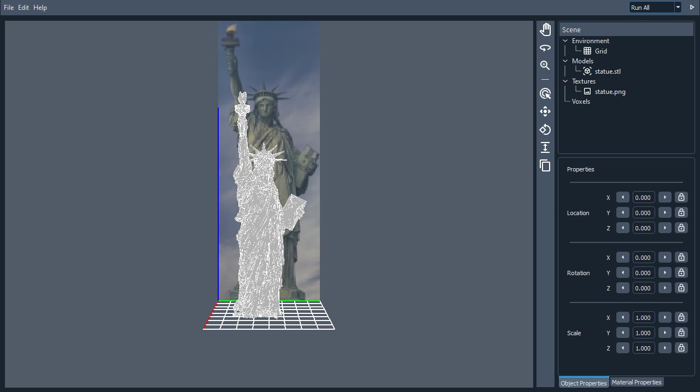
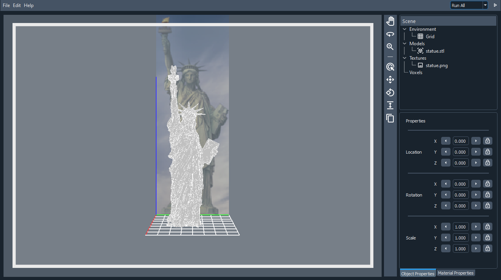
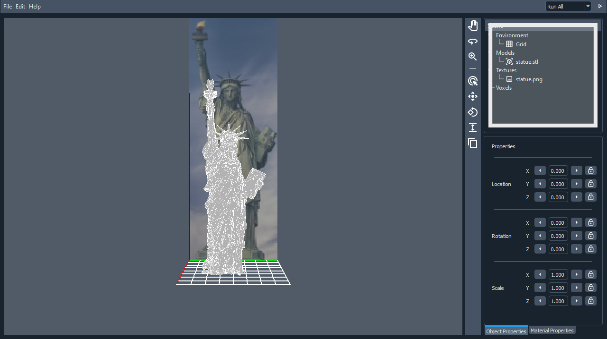
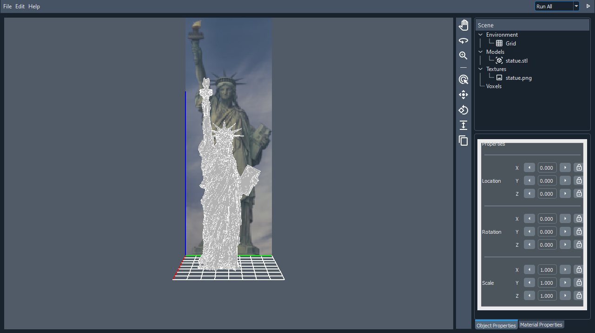
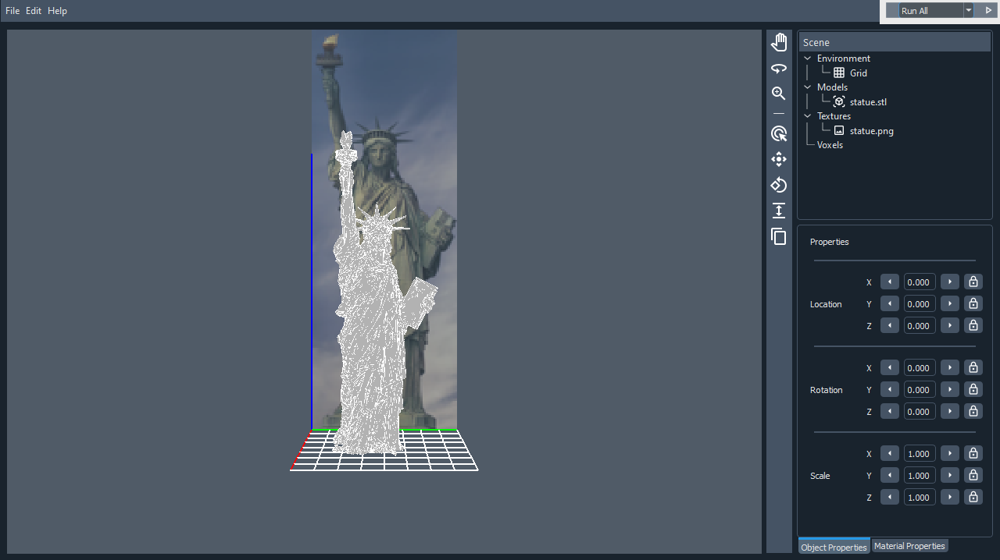

# CraftSlicer App User Manual

* [Gui Elements](#Gui-Elements)
    * [Render](#Render)
    * [Scene Collection](#Scene-Collection)
    * [Properties](#Properties)
* [Run Options](#Run-Options)
* [Performance](#Performance)

## Gui Elements

Upon startup, the following interface will be shown. A model of the Statue of Liberty imports by default as an example
model, which will be used to complete this tutorial.

The rectangle highlights the different Gui Elements.

### Render

The render panel previews the model, the reference images, and the generated blocks. Use the following controls to move
around the camera:

|Control|Function|
|-------|--------|
|Right Mouse Button + Drag|Rotate the view|
|Middle Mouse Button + Drag|Pan the view|
|Scroll Wheel|Zoom in and out|

Dragging a 3D model or a reference image onto this window imports this file and lists it in
the [Scene Collection](#Scene-Collection).

### Scene Collection

The scene collection panel lists all the previewed items in the [Render](#Render) panel. Here are the elements contained
in the four categories:

|Category|Element|
|--------|----|
|Environment|Contains the Grid element: The red, green, and blue lines in the render panel and the white grid at the bottom of the model.|
|Models|Contains all the imported models, including the default statue. All items are listed by filename. The blocks are generated with all the models in the current scene.| 
|Textures|Contains all the reference images, including the default statue. All items are listed by filename. The blocks generated previously are colored by all the textures in the current scene.|
|Voxels|Contains Minecraft-like blocks, which are generated using the models and the textures listed in the current scene.|

### Properties

The properties panel lists the properties of an element selected by left-clicking from
the [Scene Collection](#Scene-Collection). Selecting a model from the model's category, or a texture from the texture's
category will show its name at the top and its properties. Here are the three different properties and their function:

|Property|Function|
|--------|--------|
|Location|Moves the element in three axes by translation. One unit is equivalent to moving one Minecraft block. The side buttons increment or decrement the value by 1.|
|Rotation|Rotates the element in three axes by its center point. Units are in radians (180 degrees equals pi radians). The side buttons increment or decrement the value by 0.1.| 
|Scale|Scales the element in three axes by its center point. The side buttons increment or decrement the value by 0.1.

All the properties have a maximum precision of three decimals, and unlimited digits for the whole number part. Note that
the lock buttons, and the Material properties tab don't work yet.

## Run Options

The run options features a clickable dropdown, and a run button. Use the dropdown menu to select the option, and the run
button to run the selected option. Here are the functions of the five different options:

|Option|Function|
|------|--------|
|Run All|Runs the next four operations in order as one large step. For the default statue, it may require from 10 seconds and up to 2 minutes to process.|
|Convert Voxels|Uses the Models listed in the [Scene Collection](#Scene-Collection) to generate blocks and their positions. A new Voxel object is created, without colors. The blocks are previewed in the [Render](#Render).|
|Texture Voxels|This option depends on the Convert Voxels step. Uses the Textures listed in the [Scene Collection](#Scene-Collection) to color the previously generated blocks. The colors are displayed the in [Render](#Render) and updated for the Voxel object.
|Assign Blocks|This option depends on the Texture Voxels step. A dialog will be shown to select the current Minecraft version. The available blocks of this version are assigned to the colors of the Voxel object. No preview is shown in the [Render](#Render).
|Deploy|This option depends on the Assign Blocks step. A dialog will be shown to enter the author and the project's name. A file compatible with the [Litematica mod](https://github.com/maruohon/litematic) is generated and sent to the Minecraft Client directly if  the [CraftSlicer Litematica mod](https://github.com/ThatAquarel/litematica/releases/) is installed.

## Performance

CraftSlicer does not focus on performance, though it is accelerated by some optimizations. The
different [Run Options](#Run-Options) of the default model runs at these speeds on the development machine:

|Option|Speed|
|------|-----|
|Convert Voxels|~0.899 seconds|
|Texture Voxels|~2.910 seconds|
|Assign Blocks|~7.123 seconds|
|Deploy|~0.658 seconds|

Note that different machines and models may cause large variations in the processing speed. These values should only be
used as a reference.
